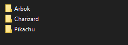
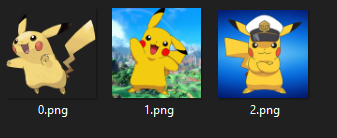

# Bingo Maker
To create and play bingo

## Functionalities
* Custom values for the bingo
* Automatically select a random value
* Creation of bingo sheets
* Automatically keep track of winners
* Custom sounds

## How to load the game
First you need to create a folder that contains the options.

This is made by having multiple folders. Each folder is an option.

In this case the options are: Arbok, Charizard and Pikachu

The name of the folders give the name of the options.

Each folder can contain multiple PNG cards with numbered names to add variety when displaying the selected value

>[!WARNING]  
>Each card must have it's name as a number and must be in PNG

## Previous cards

When a new card is selected. The previous card passes to a new area of previously selected cards.

>[!NOTE]  
>In this part, each card will use its 0.png variant to easly keep track.